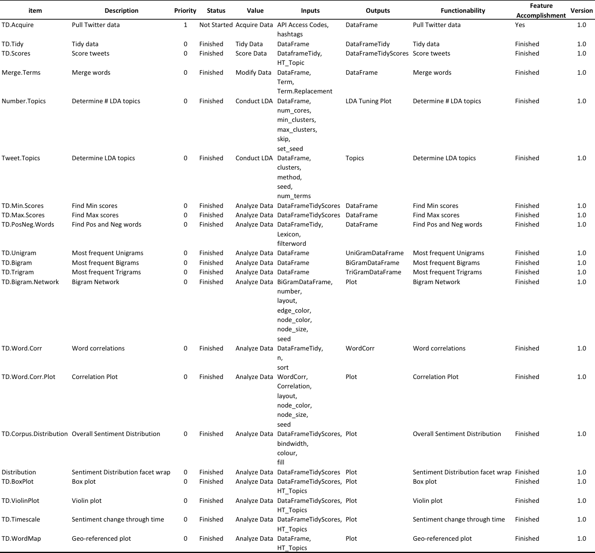

Sentiment Analysis of Twitter Data
================
CPT Evan L. Munson
14 February 2018

<!-- don't edit the .md file, instead edit the .Rmd -->

# Analytic Data Product Information

1.1 Provide a short name (either a single word or an acronym) for the
analytic you plan to develop.

*SAoTD aka: Sentiment Analysis of Twitter Data*

1.2 Provide a brief title (1-2 sentences) describing – at the
50,000-foot level – what your analytic does. Your title should be short
and to the point, but should also be clear to an end user.

*This analytic is an in initial forray into sentiment analysis. This
analytic will allow a user to access the Twitter API (once they create
their own developer account), ingest tweets of their interest, clean /
tidy data, perform topic modeling in interested, compute sentiment
scores utilizing the Bing Lexicon, and output visualizations.*

1.3 Provide a description (2-3 paragraphs) of why this analytic data
product will be useful for an end-user. This description should address
the following points (where applicable).

1.3.A Describe each of the features that your analytic will perform when
complete

  - *TD.Acquire: Access Twitter API and gather tweets.*
  - *TD.Tidy: Tidy acquired tweets.*
  - *TD.Scores: Calculates sentiment scores of tidy data using the Bing
    Lexicon.*)
  - *Merge.Terms: Function received from Capt Jeff Smith, that will
    merge terms and is used to reduce redundancy.*
  - *Number.Topics: Produces an Latent Dirichlet Allocation (LDA) tuning
    graph that will assist a user determining how many latent topics are
    within their twitter data.*
  - *Tweet.Topics: Determines the contents of the latent topics within
    the twitter data.*
  - \-TD.Min.Scores: Two part function. Will output dataframe with the
    most negative scored tweets in the entire dataframe. Secondarily,
    the function can also be used to find the most negative tweets
    associated with a user defined \#hashtags or topics.\_
  - *TD.Max.Scores: Two part function. Will output dataframe with the
    most positive scored tweets in the entire dataframe. Secondarily,
    the function can also be used to find the most positive tweets
    associated with a user defined \#hashtags or topics.*
  - *TD.PosNeg.Words: Outputs a chart with the top ten, most positive
    and negative words within the entire dataframe.*
  - *TD.Unigram: Displays the most frequent Uni-grams within the
    dataframe.*
  - \-TD.Bigram: Displays the most frequent Bi-grams within the
    dataframe.\_
  - *TD.Trigram: Displays the most frequent Tri-grams within the
    dataframe.*
  - *TD.Bigram.Network: Outputs chart showing the Bi-gram interactions
    between words within dataframe. Has multiple aesthetic options.*
  - *TD.Word.Corr: Determines the correlations between all words within
    the dataframe.*
  - *TD.Word.Corr.Plot: Outputs chart showing the correlation between
    words within dataframe. Has multiple aesthetic options.*
  - *TD.Corups.Distribution: Chart with the overall sentiment
    distribution across the entire dataframe / corpus.*
  - *TD.Distribution: Facet wrap chart displaying a comparision between
    the sentiemnt distributions for each \#hashtag or topic.*
  - *TD.BoxPlot: Displays box plot for \#hashtag or topic data.*
  - *TD.ViolinPlot: Displays violin plot for \#hashtag or topic data.*
  - *TD.Timescale: Plot that displays the change in sentiemnt based
    either on the \#hashtags or selected topics throught time.*
  - *TD.WorldMap: Plots the geo-referenced location of tweets by
    \#hashtag or tweet across the globe.*

1.3.B Describe the typical end-user for whom this analytic is being
developed

*This package is being developed for novice analysts.*

1.3.C Describe any specific knowledge/skills/abilities an end-user must
have to use your analytic

*Basic understanding of twitter and social media.*

1.3.D If your analytic implements known statistical methods, specified
them.

*Distributions, bi-modal distributions*

1.3.E If your analytic builds on existing statistical methods or R
packages, specify them

*Tidyverse, LDATuning, Topicmodel*

1.4 How will end-users access your analytic data product?

*Package*

1.5 Are there any security concerns that need to be addressed?

*No*

1.6 Are there any appearance/design constraints that your analytic must
adhere to?

*Sponsor has requested a well built package they could expand into a
Shiny app if desired.*

# Delivery and schedule information

2.1 Review the features you listed in Section 1.3.A. Construct a table
with the following information

