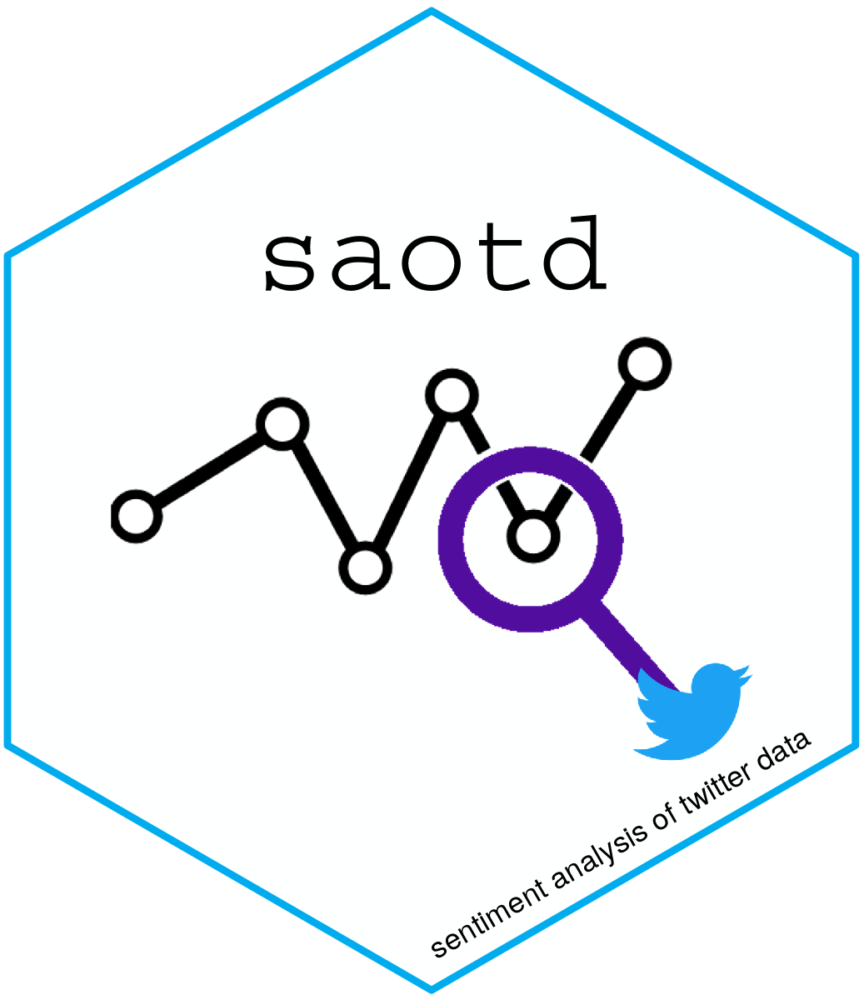

# Sentiment Analysis of Twitter Data 

[](https://cran.r-project.org/package=saotd)
[](https://github.com/evan-l-munson/saotd/actions?workflow=R-CMD-check)
[](https://app.codecov.io/gh/evan-l-munson/saotd)
[](https://CRAN.R-project.org/package=saotd)
[](https://CRAN.R-project.org/package=saotd)

[](https://joss.theoj.org/papers/10.21105/joss.00764)
[](https://doi.org/10.5281/zenodo.2578973)

## Purpose 

This package is focused on utilizing Twitter data due to its widespread
global acceptance. The rapid expansion and acceptance of social media
has opened doors into opinions and perceptions that were never as
accessible as they are with today’s prevalence of mobile technology.
Harvested Twitter data, analyzed for opinions and sentiment can provide
powerful insight into a population. This insight can assist companies by
letting them better understand their target population. The knowledge
gained can also enable governments to better understand a population so
they can make more informed decisions for that population. During the
course of this research, data was acquired through the Public Twitter
Application Programming Interface (API), to obtain Tweets as the
foundation of data and will build a methodology utilizing a topic
modeling and lexicographical approach to analyze the sentiment and
opinions of text in English to determine a general sentiment such as
positive or negative. The more people express themselves on social
media, this application can be used to gauge the general feeling of
people.

## Package

The `saotd` package is an R interface to the Twitter API and can be used
to acquire Tweets based on user selected \#hashtags and was developed
utilizing a tidyverse approach. The package was designed to allow a user
to conduct a complete analysis with the contained functions. The package
will clean and tidy the Twitter data, determine the latent topics within
the Tweets utilizing Latent Dirichlet Allocation (LDA), determine a
sentiment score using the Bing lexicon dictionary and output
visualizations.

## Installation

You can install the CRAN version using:

``` r
install.packages("saotd")
```

You can install the development version from GitHub using:

``` r
install.packages("devtools")
devtools::install_github('evan-l-munson/saotd', build_vignettes = TRUE)
```

## Using saotd

The functions that are provided by `saotd` are broken down into five
different categories: Acquire, Explore, Topic Analysis, Sentiment
Calculation, and Visualizations.

-   Acquire

    -   `tweet_acquire` allows a user to acquire Tweets of their
        choosing by accessing the Twitter API. In order to do this the
        user needs to have a [Twitter](https://twitter.com) account.
        Additionally once the user has an account they will then need to
        sign up for a [Twitter Developers](https://developer.twitter.com/apps)
        account. Once a user has a Twitter developers account and has
        received their individual consumer key, consumer secret key,
        access token, and access secret key, they can acquire Tweets
        based on a list of hashtags and a requested number of entries
        per hashtag.

-   Explore

    -   `tweet_tidy` removes all emoticons, punctuation, weblinks, etc
        and converts converts the data to a tidy structure.
    -   `merge_terms` merges terms within a dataframe and prevents
        redundancy in the analysis.
    -   `unigram` displays the text Uni-Grams within the Twitter data in
        sequence from the most used to the least used. A Uni-Gram is a
        single word.
    -   `bigram` displays the text Bi-Grams within the Twitter data in
        sequence from the most used to the least used. A Bi-Gram is a
        combination of two consecutive words.
    -   `trigram` displays the text Tri-Grams within the Twitter data in
        sequence from the most used to the least used. A Tri-Gram is a
        combination of three consecutive words.
    -   `bigram_network` Bi-Gram networks builds on computed Bi-Grams.
        Bi-Gram networks serve as a visualization tool that displays the
        relationships between the words simultaneously as opposed to a
        tabular display of Bi-Gram words.
    -   `word_corr` displays the word correlation between words.
    -   `word_corr_network` displays the mutual relationship between
        words. The correlation network shows higher correlations with a
        thicker and darker edge color.

-   Topic Analysis

    -   `number_topics` determines the optimal number of Latent topics
        within a dataframe by tuning the Latent Dirichlet Allocation
        (LDA) model parameters. Uses the `ldatuning` package and outputs
        an ldatuning plot. **This process can be time consuming
        depending on the size of the dataframe.**
    -   `tweet_topics` determines the Latent topics within a dataframe
        by using Latent Dirichlet Allocation (LDA) model parameters.
        Uses the `ldatuning` package and outputs an ldatuning plot.
        Prepares Tweet text, creates DTM, conducts LDA, display data
        terms associated with each topic.

-   Sentiment Calculation

    -   `tweet_scores` calculates the Sentiment Scores using the [Bing
        Lexicon
        Dictionary](https://www.cs.uic.edu/~liub/FBS/sentiment-analysis.html)
        that will account for sentiment by hashtag or topic.
    -   `posneg_words` determines and displays the most positive and
        negative words within the Twitter data.
    -   `tweet_min_scores` determines the minimum scores for either the
        entire dataset or the minimum scores associated with a hashtag
        or topic analysis.
    -   `tweet_max_scores` determines the maximum scores for either the
        entire dataset or the maximum scores associated with a hashtag
        or topic analysis.

-   Visualizations

    -   `tweet_corpus_distribution` determines the scores distribution
        for the entire Twitter data corpus.
    -   `tweet_distribution` determines the scores distribution by
        hashtag or topic for Twitter data.
    -   `tweet_box` displays the distribution scores of either hashtag
        or topic Twitter data.
    -   `tweet_violin` displays the distribution scores of either
        hashtag or topic Twitter data.
    -   `tweet_time` displays how the Twitter data sentiment scores
        through time.  
    -   `tweet_worldmap` function is not longer exported, as the Twitter data 
        does not contain latitude and longitude values.  Displays the location 
        of a Tweet across the globe by hashtag or topic.

## Example

For an example of how to use this package, find the vignette at:

``` r
library(saotd)
utils::vignette("saotd")
```

## Meta

-   license:

    -   All code is licensed GPL.
    -   All data is from public data sources.

-   Get citation information for `saotd` in R by running:

``` r
citation("saotd")
```

## Getting help

If you encounter a clear bug, please file a minimal reproducible example
on [github](https://github.com/evan-l-munson/saotd/issues).

## Contributing

If you would like to contribute, please create a [Pull
Request](https://github.com/evan-l-munson/saotd/pulls) and make
appropriate applicable changes for review.

## References

-   [AFIT Data Science Lab](https://github.com/AFIT-R)
-   [Tidyverse](https://www.tidyverse.org/)
-   [Text Mining with R](https://www.tidytextmining.com/)
-   [ldatuning](https://CRAN.R-project.org/package=ldatuning)
-   [topicmodels](https://CRAN.R-project.org/package=topicmodels)
